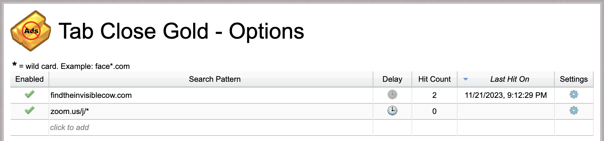

## Tab-Close-Gold
Firefox, Chrome, and Edge browser extension to auto close tabs. Formerly known as "Ad Close Gold"

 

Close tabs by configuring search patterns that match website url's or titles. Search patterns can be keywords with wildcards or regular expressions. 

Keeps track of tabs it closes and supports exporting and importing configurations.

The extension will sync configs across your browsers if you are using the synchronization functionality of your browser.

## Download 

 [Chrome](https://chromewebstore.google.com/detail/tab-close-gold/blhbohajaekmpblcffpkpogkhkmmbbhf)

 [Firefox](https://addons.mozilla.org/en-US/firefox/addon/tab-close-gold/)

 [Edge](https://microsoftedge.microsoft.com/addons/detail/tab-close-gold/pnaijbhnlgedechkiepkfflfafaplckk)

Visit the wiki to learn more about how to use the extension: https://github.com/mukunku/Tab-Close-Gold/wiki

## How to build locally

Follow these steps to get the extension working locally.

#### Testing in Chrome/Edge
1. Clone the repo and open a command prompt to the `src` folder
2. Run `npm install`
3. Once that completes run `npm run build:watch`
   * This way any time you make a change the app will re-transpile everything automatically
4. Enable developer mode in the browser's extensions page
   * For Chrome go to `chrome://extensions/` and enable developer mode in the top-right corner
   * For Edge go to `edge://extensions/` and enable developer mode in the left navigation bar
5. Click `Load unpacked` and select the `src` folder
6. The browser will now have your local version of the extension running
7. As you make code changes you can click `Update` to update the extension in Chrome.

#### Testing in Firefox
1. Clone the repo and open a command prompt to the `src` folder
2. Run `npm install`
3. Once that completes run `npm run publish-debug`
    * This will generate `/src/publish.firefox.zip`
4. In Firefox go to `about:addons` 
5. Click on the gear icon and select `Debug Add-ons`
5. Next click `Load Temporary Add-on...` and select `publish.firefox.zip`
6. Firefox will now have your local version of the extension running
7. To push further code changes to Firefox you'll need to redo these steps each time
